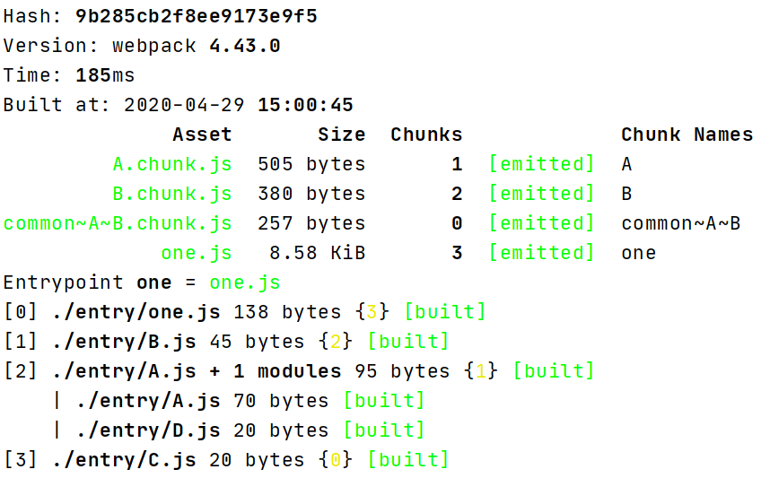

# webpack-split-chunks-analytics
webpack分块分析

## 安装

安装依赖 <br />
`npm install`

运行示例 <br />
`npx ts-node ./examples/01.ts`

## 使用

配置文件模块和webpack的分块策略，然后会在命令行打印打包后的模块分布

示例：

```ts
import build from './scripts/main'

build({
  modulesStructure: [
    {
      name: 'one',
      asyncImport: [{
          name: 'A',
          syncImport: [{name: 'C',}, {name: 'D'}]
        },{
          name: 'B',
          syncImport: [{name: 'C'}]
        }
      ]
    }
  ],
  splitChunks:{
    minSize:1,
    cacheGroups:{
      "default":false,
      "common":{
        test:/C/
      }
    }
  }
});
```



## API

### build(options)


#### options

```ts
interface ModuleDescribe {
  name: string,
  size?: number,
  syncImport?: ModuleDescribe[]
  asyncImport?: ModuleDescribe[]
}

type Options = ModuleDescribe[];
```

#### options.name
模块文件名称

#### options.size
模块文件尺寸（单位字节）

#### options.syncImport
静态导入的模块

#### options.asyncImport
动态导入的模块

## License

[MIT](http://opensource.org/licenses/MIT)
